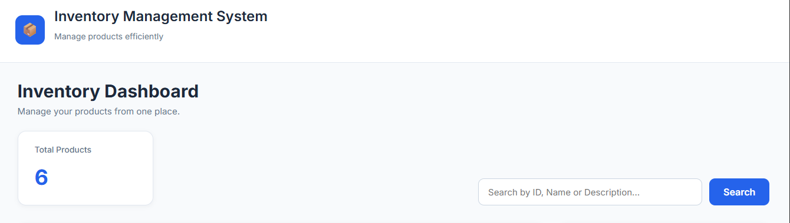
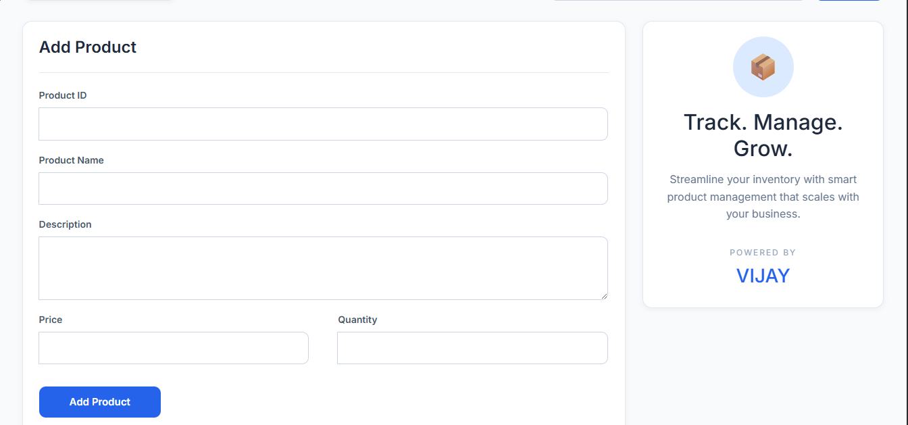
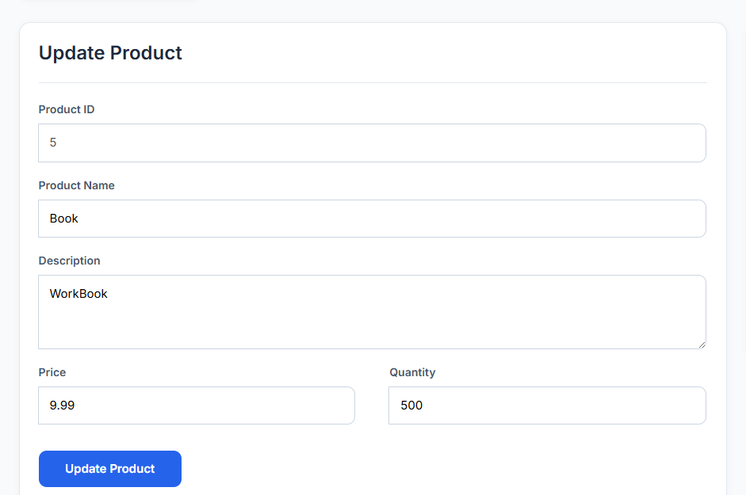
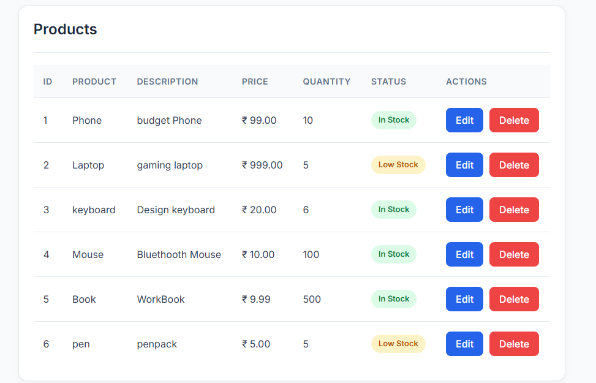

# 📦 Inventory Management System

A modern Full Stack **Inventory Management System** developed using **React**, **FastAPI**, **SQLAlchemy**, and **MySQL**. This project provides a clean and responsive interface to efficiently manage inventory through complete CRUD operations and REST APIs.

---

##  Current Version

**Version 2.0 – Professional UI & User Experience Improvements**

---

##  Features

### Product Management
-  Add New Product
-  Update Existing Product
-  Delete Product with Confirmation
-  Search Product by ID, Name, or Description

### Dashboard
-  Inventory Dashboard
-  Product Summary Card
-  Professional Product Table
-  Responsive User Interface

### User Experience
-  Form Validation
-  Toast Notifications
-  Auto Scroll to Update Form
-  Empty State Design
-  Modern Component-Based UI

### Backend
-  FastAPI REST APIs
-  SQLAlchemy ORM
-  MySQL Database Integration

---

# Technology Stack

## Frontend

- React.js
- Axios
- CSS3
- React Toastify

## Backend

- FastAPI
- Python
- SQLAlchemy

## Database

- MySQL
- PyMySQL

## Development Tools

- Git
- GitHub
- VS Code

---

# Project Structure

```
inventory-management-system
│
├── frontend
│   ├── src
│   │   ├── components
│   │   ├── styles
│   │   ├── App.js
│   │   └── index.js
│   │
│   └── package.json
│
├── database.py
├── database_models.py
├── main.py
├── models.py
└── README.md
```

---

# Getting Started

## Clone Repository

```bash
git clone https://github.com/VIJAYKUMAR111543/inventory-management-system.git
```

## Backend

```bash
python -m venv myenv

myenv\Scripts\activate

pip install -r requirements.txt

uvicorn main:app --reload
```

## Frontend

```bash
cd frontend

npm install

npm start
```

---

#  Screenshots

## Dashboard



---

## Add Product



---

## Update Product



---

## Product List



---

#  Future Enhancements

- JWT Authentication
- Product Categories
- Product Image Upload
- Dashboard Analytics
- Pagination
- Sorting & Filtering
- Docker Deployment
- Cloud Deployment

---

# 👨‍💻 Author

**Vijay Kumar B**

GitHub:
https://github.com/VIJAYKUMAR111543
